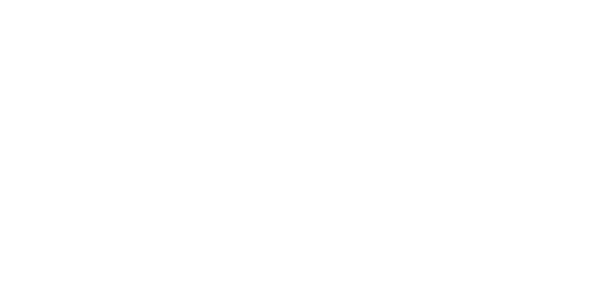

# [WaveCheck.me](https://wavecheckme.onrender.com/)
## Overview
A [Bitcamp 2022](https://2022.bit.camp/) Project focusing on using artificial 
intelligence and machine learning to provide better song recommendations to 
users!

 ***[Project Roadmap](https://trello.com/invite/b/6250f213df39c76e7c95e304/ATTI2d9cc201ce38df85a7c81e2f947cdbf458627FD2/project-roadmap)***

**<ins>Written & Programmed by:</ins>**
- Alex Dobrzycki (Backend)
- Alejandro Echaniz (Full Stack)
- Maia Gustafson (Frontend)
- Spencer Lutz (Backend, AI/ML)

### specs
- Node *v18.20.4*

### APIs
|   **Name**   | **Description** |
| :------: | :---------- |
|   [Spotify for Developrs](https://developer.spotify.com/) | Aiding for search autofill and playing song samples |
| [Apple Music API](https://developer.apple.com/documentation/applemusicapi) | Training AI/ML recommendation Model |

